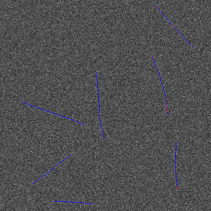

# Prior-Apprised Unsupervised Learning (PAUL) of curvilinear features from 3D images
Implementation of PAUL framwork on curvilinear features from 3D images. Please cite the associated publication as: Shuhui Yin, M. Junaid Amin, Nyssa T. Emerson, and Haw Yang "Three-dimensional super line-localization in low signal-to-noise microscope images via prior-apprised unsupervised learning (PAUL)", Proc. SPIE 11510, Applications of Digital Image Processing XLIII, 115101L (21 August 2020); https://doi.org/10.1117/12.2567752

## Requirements
The code uses the following toolboxes and versions at the stage of development; earlier versions might also work:
* 'MATLAB' '9.7'
* 'Image Processing Toolbox' '11.0' 
* 'Statistics and Machine Learning Toolbox' '11.6' 
* 'Phased Array System Toolbox' '4.2'
* 'Parallel Computing Toolbox' '7.1' 
* 'MATLAB Parallel Server' '7.0'
* 'Polyspace Bug Finder' '3.1'

## Syntax
```
batchMTComputation(OutputFileName, image3D, GridSize, NumOfShifts, PSFsigma, pixelSize);
batchMTComputation(OutputFileName, image2D, GridSize, NumOfShifts, PSFsigma, pixelSize, alpha);
batchMTComputation(OutputFileName, image2D, GridSize, NumOfShifts, PSFsigma, pixelSize, alpha, beta);
batchMTComputation(OutputFileName, image2D, GridSize, NumOfShifts, PSFsigma, pixelSize, alpha, beta, cRatio);
batchMTComputation(OutputFileName, image2D, GridSize, NumOfShifts, PSFsigma, pixelSize, alpha, beta, cRatio, estimatedLp);
batchMTComputation(OutputFileName, image2D, GridSize, NumOfShifts, PSFsigma, pixelSize, alpha, beta, cRatio, estimatedLp, gridPtUnit);
```

## Input arguments
* `OutputFileName` — the string that contains the output file name.
* `image3D` — numeric array of a single input image or cells of numeric arrays of multiple images. The input image needs to be grayscale and **square prism** (e.g. 512 x 512 x 40 pixels). The voxel values can be 8-bit, 16-bit or double. 
* `GridSize` — the side of the sub image along the most sampled dimension. It should divide the larger image side (e.g. for 512 x 512 x 40 images, `GridSize` cannot fall out of {1, 2, 4, 8, 16, 32, 64, 128, 256, 512}).
* `NumOfShifts` — the number of shifts applied in stage two.
* `PSFsigma` — the standard deviations of the approximated Gaussian point-spread function (PSF), in the unit of micrometers. It can be a scalar (if all three standard deviations are the same), a 1x2 (or 2x1) vector (if two of them are identical), or a 1x3 (or 3x1) vector. The order should match that of the input image dimensions.
* `pixelSize` — the size of the voxel, in the unit of micrometers. It can be a scalar (if all three standard deviations are the same), a 1x2 (or 2x1) vector (if two of them are identical), or a 1x3 (or 3x1) vector. The order should match that of the input image dimensions.
* `alpha` — the alpha parameter in stage one. Default is 0.5. Put `[]` if using the default value.
* `beta` — the beta parameter in stage one. Default is 0.5. Put `[]` if using the default value.
* `cRatio` — the ratio between c and maximum S in stage one. Default is 5. Put `[]` if using the default value.
* `estimatedLp` — the estimated persistence length of the features to be detected, in the unit of micrometers. Default is 5200. Put `[]` if using the default value.
* `gridPtUnit` — the grid point density in the final PAUL principal curve, in the unit of voxels. Default is 0.1.


## Output
The output is saved in a .mat file containing the following variables:
* `FinalX_central_allGps` (or `FinalX_central_allGps_allIMs`), `FinalY_central_allGps` (or `FinalY_central_allGps_allIMs`), `FinalZ_central_allGps` (or `FinalZ_central_allGps_allIMs`) — x, y and z coordinates of the final PAUL principal curve, in the voxel space.
* `FinalX_B95_allGps` (or `FinalX_B95_allGps_allIMs`), `FinalY_B95_allGps` (or `FinalY_B95_allGps_allIMs`), `FinalZ_B95_allGps` (or `FinalZ_B95_allGps_allIMs`) — x, y and z coordinates of the meshgrid representing the 95% bounds of the final PAUL principal curve, in the voxel space.
* `medium95PercError` (or `medium95PercError_allIMs`) — medians of all 95% bootstrap bounds, in the unit of voxels.

## Example

Run PAUL procedure on an example image ('Examples/image3D_1.mat')
```matlab
>> load('Example/image3D_1.mat');
>> batchMTComputation3D('example_result',example_image,32,8,[0.1376 0.5229],[0.076 0.23],[],[],[],100);
```

Plot the result
```matlab
load('Example/image3D_1.mat');
load('Example/image3D_1_result_Division_32x8.mat');
imagesc(sum(example_image,3)); % display the sum intensity projection
hold on
for i = 1:length(FinalX_central_allGps)
    plot3(FinalY_central_allGps{i},FinalX_central_allGps{i},FinalZ_central_allGps{i},'Color','b','LineWidth',0.5);
    plotUncertaintyTube(FinalY_B95_allGps{i},FinalX_B95_allGps{i},FinalZ_B95_allGps{i},'r',0.9,0.01);
end
```
 


